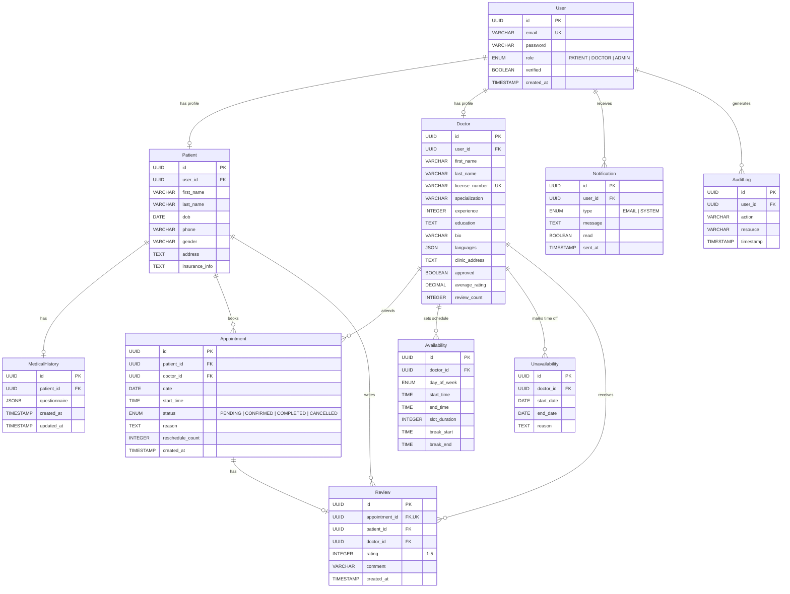

<div align="center">

# Healthcare Appointment Booking API

Healthcare Appointment Booking RESTful API. Originally developed as a Capstone Project for the Software Praktikum, this platform provides secure scheduling, role-based access control, and comprehensive user management. It seamlessly handles everything from robust doctor-patient interaction and real-time scheduling to reliable cloud deployment.


[](#testing)
[](API_REFERENCE.md)
[](#database-schema)

</div>

---

## Live Demo

| | URL |
|---|---|
| **Base API** | https://healthapp-backend-v2-186862202342.us-central1.run.app |
| **Swagger UI** | https://healthapp-backend-v2-186862202342.us-central1.run.app/swagger-ui/index.html |

---

## Table of Contents

- [Key Features](#key-features)
- [Tech Stack](#tech-stack)
- [Architecture](#architecture)
- [Database Schema](#database-schema)
- [API Reference](#api-reference)
- [Testing](#testing)
- [Getting Started](#getting-started)

---

## Key Features

- **JWT Authentication & RBAC** — Three distinct roles (`Patient`, `Doctor`, `Admin`) with email verification and password reset via SendGrid
- **Intelligent Scheduling** — Double-booking prevention at both application and database level, 24-hour cancellation policy, maximum one reschedule per appointment
- **Doctor Discovery** — Public multi-criteria search with filtering, sorting, and pagination
- **Reviews & Ratings** — Denormalized average ratings for O(1) read performance on search results
- **Admin Panel** — Dashboard statistics, user management (suspend/activate), doctor approval workflow, audit logging
- **Cloud Deployment** — Multi-stage Docker build, Google Cloud Run with auto-scaling, Cloud SQL managed PostgreSQL

---

## Tech Stack

| Layer | Technology |
|-------|-----------|
| **Language** | Java 21 |
| **Framework** | Spring Boot 3.5.7 (Web, Security, Data JPA, Validation, Actuator) |
| **Database** | PostgreSQL 15 (Cloud SQL in production, H2 for tests) |
| **Authentication** | Spring Security + JWT (jjwt 0.12.3) |
| **Email** | SendGrid Web API |
| **API Docs** | SpringDoc OpenAPI (Swagger UI) |
| **Build** | Maven + Lombok |
| **Containerization** | Docker + Docker Compose |
| **Cloud** | Google Cloud Run + Cloud SQL + Artifact Registry |
| **Testing** | JUnit 5 + Mockito + Spring Boot Test + MockMvc |

---

## Architecture

The application follows a **layered architecture** pattern:

```
HTTP Request
     |
  JWT Authentication Filter          -- Validates token before request reaches controller
     |
  Controller Layer                   -- REST endpoints + @PreAuthorize role checks
     |
  Service Layer                      -- Business logic + @Transactional atomicity
     |
  Repository Layer                   -- JPA repositories + custom @Query methods
     |
  PostgreSQL Database                -- Constraints, indexes, JSONB support
```

**Project Structure:**
```
src/main/java/com/healthapp/backend/
├── config/          # Security, CORS, Swagger configuration
├── controller/      # 8 REST controllers (43 endpoints)
├── dto/             # Request/Response DTOs with validation
├── entity/          # JPA entities (10 tables)
├── enums/           # Role, AppointmentStatus, DayOfWeek
├── exception/       # Global exception handler
├── repository/      # Spring Data JPA repositories
├── security/        # JWT provider, auth filter, UserDetails
├── service/         # Business logic services
└── converter/       # JSONB and List type converters
```

---

## Database Schema

**10 tables** with foreign key relationships, indexes, and constraints:



---

## API Reference

The API exposes **43 endpoints** across 7 domains (Authentication, Profiles, Availability, Appointments, Doctor Search, Reviews, Admin).

**[Full API Reference (API_REFERENCE.md)](API_REFERENCE.md)** — complete list with HTTP methods, paths, roles, and descriptions.

> Interactive Swagger UI available at `/swagger-ui/index.html` when the app is running.

---

## Testing

```
Tests run: 123, Failures: 0, Errors: 0, Skipped: 0
BUILD SUCCESS
```

**123 automated tests** covering both unit and integration layers:

| Test Suite | Type | Tests |
|-----------|------|:-----:|
| AuthenticationServiceTest | Unit | 11 |
| UserServiceTest | Unit | 11 |
| ProfileServiceTest | Unit | 13 |
| AvailabilityServiceTest | Unit | 9 |
| AppointmentServiceTest | Unit | 5 |
| ReviewServiceTest | Unit | 14 |
| SearchServiceTest | Unit | 11 |
| AuthControllerTest | Integration | 14 |
| AvailabilityControllerTest | Integration | 14 |
| AppointmentControllerTest | Integration | 3 |
| ReviewControllerTest | Integration | 2 |
| DoctorControllerTest | Integration | 17 |

**Business rules validated:** double-booking prevention, 24-hour cancellation policy, one review per appointment, author-only review modification, automatic rating recalculation, public vs. protected endpoint access, sorting-after-filtering correctness.

---

## Getting Started

For full local setup instructions (PostgreSQL, environment variables, Maven, Docker):

**[Setup Guide (SETUP.md)](SETUP.md)**

**Quick start with Docker Compose:**
```bash
git clone https://github.com/<your-username>/HealthServicesApp.git
cd HealthServicesApp
cp .env.example .env
docker compose up
```

The API will be available at `http://localhost:8080` and Swagger UI at `http://localhost:8080/swagger-ui/index.html`.

---

## License

Distributed under the MIT License. See  for more information.
